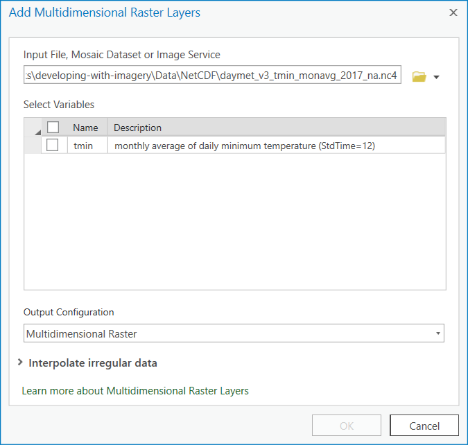
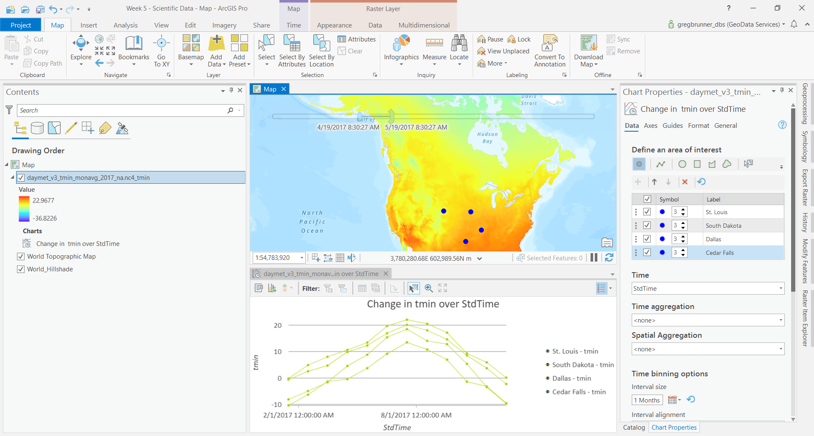

# 3D and 4D Data
In this lecture we will discuss multidimmensional data. We will learn how you can interact with it through ArcGIS Pro, arcpy, and xarray](http://xarray.pydata.org/en/stable/) and different kinds of analysis that can be done agaist spatio-temporal scientific datasets.

This week, we will use the [DAYMET monthly climate summary NetCDF datasets](https://daac.ornl.gov/DAYMET/guides/Daymet_V3_Monthly_Climatology.html)

# Preparation
1. [Multidimensional Data](https://www.esri.com/arcgis-blog/products/arcgis-pro/imagery/multidimensional-analysis-arcgis-pro/) and [Multidimmensional Analysis in ArcGIS Pro](https://youtu.be/qBACfb2sMo8)
2. [Python: Working with Multidimensional Scientific Data](https://www.esri.com/videos/watch?videoid=lqKYoiFlCJc)
3. [Xarray](https://www.youtube.com/watch?v=Dgr_d8iEWk4)

# Lecture 1 - Multidimensional Data in ArcGIS Pro
1. Create a new ArcGIS Pro Map Project
2. Add Data
3. Choose Multidimensional Raster Layer and then add **daymet_v3_tmin_monavg_2017_na.nc4***.

4. Notice how th data gets added with a time-slider in the view.

5. Right click on layer in Table of Contents. **Select Create Chart** -> **Temporal Profile**
6. Set chart parameters.
7. Choose **Point** for **Area of Interest** and click on map to see temperature profile.

8. Export Raster as CRF. We will use this as input into the arcpy API.

# Lecture 2 - Multidimensional Data with Arcpy
Demonstrate how we can use **Raster** objects using the **arcpy API** to do similar analysis. This can be demonstrated through the **multidimensional_data_using_arcpy_api.ipynb** Notebook.

# Lecture 3 - Multidimensional Data with Xarray

# Lecture 4 (if there is enough time) - Multidimensional Data in Python Raster Functions


# Exercise
1. Run through the ArcGIS Tutorial on [Multidimensional raster analysis in ArcGIS Pro](https://doc.arcgis.com/en/imagery/workflows/tutorials/multidimensional-raster-analysis-in-arcgis-pro.htm?adumkts=product&adupro=ArcGIS_Image_Analyst&aduc=social&adum=external&utm_Source=social&aduca=Imagery&RemoteSensing&adulb=multiple&adusn=multiple&aduat=blog&sf_id=701f2000000rpWvAAI)

# Challenges
1. Create a mosaic dataset from all of the **DAYMET** NetCDF files in the **tmax** folder. Using the mosaic dataset, crreate temporal charts showing the tempertature change over time from beginning of the dataset to the end for the cities of New York, Houston, Minneapolis, and Los Angeles. Do you notice any trend in the profiles other than the seasonality?  **Submit the plots as graphics.** They can be saved out of ArcGIS Pro as graphics.
2. Using the arcpy API, use the mosaic dataset that you creates and create a temperature profile using Python over Houston, TX. You can get the pixel values using ```arcpy.GetCellValue_management()```, for example:
```
for i in range(12):
    out_raster_subset = arcpy.ia.Subset(myRaster, variables='tmin', dimension_definitions = {'stdTime': myRaster.getDimensionValues('tmin', 'StdTime')[i]})   
    
    print(arcpy.GetCellValue_management(out_raster_subset, location_point="0 0"))
```
**Submit your Notebook.**

3.

# Links
[Digital Earth Africa](https://www.africageoportal.com/pages/digital-earth-africa)

